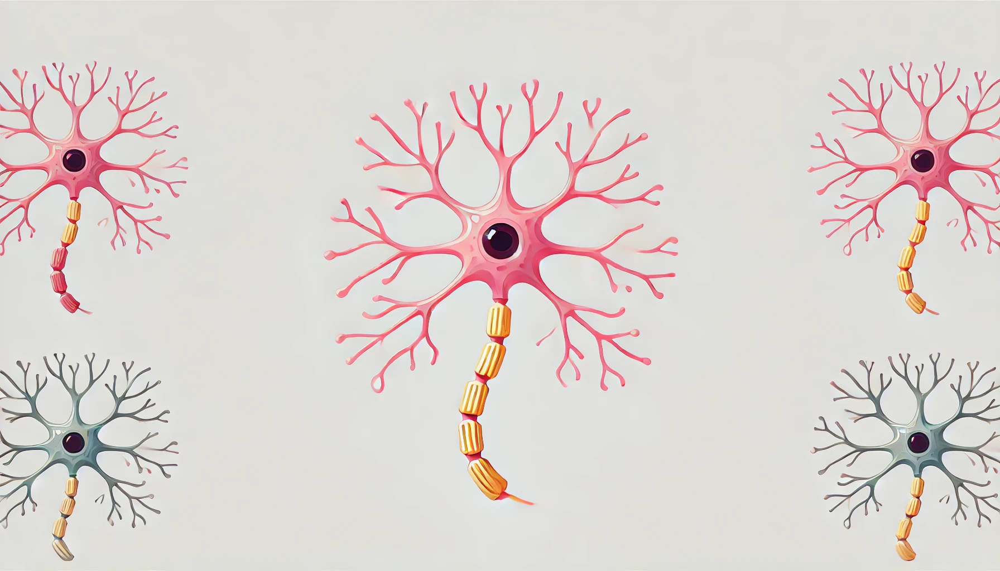

# 🧠 Simulador de Neurona Artificial 2.0



https://neurona-artificial-2.streamlit.app

Aplicación web interactiva desarrollada con Streamlit que simula el funcionamiento de una neurona artificial con características personalizables.

## ✨ Características

- Interfaz web moderna e intuitiva desarrollada con Streamlit
- Personalización completa de la neurona:
  - Número variable de entradas (1-10)
  - Pesos ajustables para cada entrada
  - Sesgo (bias) configurable
  - Múltiples funciones de activación:
    - Sigmoide
    - ReLU
    - Tangente Hiperbólica
- Visualización en tiempo real de:
  - Suma ponderada (z)
  - Función de activación aplicada
  - Resultado final
- Diseño responsivo y estético
- Containerización con Docker para fácil despliegue

## 🛠️ Requisitos

- Python 3.8+
- Streamlit
- NumPy
- Pillow
- Docker (opcional)

## 📦 Instalación

### Opción 1: Local
```bash
# Clonar repositorio
git clone <url-repositorio>

# Instalar dependencias
pip install -r requirements.txt

# Ejecutar aplicación
streamlit run streamlit_app.py
```

### Opción 2: Docker
```bash
# Construir imagen
docker build -t neurona-artificial .

# Ejecutar contenedor
docker run -p 8501:8501 neurona-artificial
```

### Opción 3: Docker Compose
```bash
# Levantar el servicio
docker-compose up

# Para detener el servicio
docker-compose down
```

## 📁 Estructura del Proyecto
```
.
├── streamlit_app.py      # Aplicación principal de Streamlit
├── requirements.txt      # Dependencias del proyecto
├── Dockerfile           # Configuración para construir la imagen Docker
├── docker-compose.yml   # Configuración para Docker Compose
├── neurona.jpg          # Imagen de la neurona para la interfaz
└── README.md           # Documentación del proyecto
```

## 🚀 Uso

1. Seleccione el número de entradas/pesos usando el slider (1-10)
2. Configure los pesos (w) para cada entrada
3. Establezca los valores de entrada (x)
4. Ajuste el valor del sesgo (b)
5. Seleccione la función de activación deseada:
   - Sigmoide: σ(z) = 1 / (1 + e^(-z))
   - ReLU: max(0, z)
   - Tangente Hiperbólica: tanh(z)
6. Presione el botón "Calcular Salida" para ver los resultados

## 🔍 Resultados

La aplicación mostrará:
- La suma ponderada (z = Σ wi·xi + b)
- La fórmula de la función de activación seleccionada
- El resultado final de la neurona

## 📝 Fórmulas Matemáticas
* Neurona Simple: y = w * x
* Neurona Dos Entradas: y = w₁x₁ + w₂x₂
* Neurona Tres Entradas: y = w₁x₁ + w₂x₂ + w₃x₃ + bias

## 📄 Licencia
Este proyecto está bajo la Licencia MIT.
